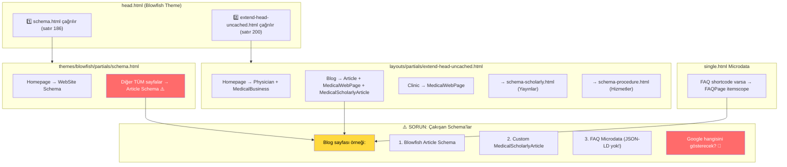

## GENEL SCHEMA ANALİZİ VE ÇAKIŞMALARIN TESPİTİ

### 1. Schema Çağrı Akışı

### 2. Detaylı Schema Analizi

| Sayfa Tipi    | Blowfish (schema.html) | Custom (extend-head)           | Özel Partial               | Microdata         | SONUÇ      |
| ------------- | ---------------------- | ------------------------------ | -------------------------- | ----------------- | ---------- |
| Homepage      | ✅ WebSite             | ✅ Physician + MedicalBusiness | -                          | -                 | ✅ İyi     |
| Blog Yazıları | ⚠️ Article (çakışma!)  | ✅ Article + MedicalWebPage    | -                          | FAQ varsa FAQPage | ⚠️ Çakışma |
| Hizmetler     | ⚠️ Article (çakışma!)  | -                              | ✅ MedicalProcedure        | FAQ varsa FAQPage | ⚠️ Çakışma |
| Yayınlar      | ⚠️ Article (çakışma!)  | -                              | ✅ MedicalScholarlyArticle | -                 | ⚠️ Çakışma |
| Klinik        | ⚠️ Article (çakışma!)  | ✅ MedicalWebPage              | -                          | -                 | ⚠️ Çakışma |

### 3. Tespit Edilen Sorunlar

#### 3.1. Blowfish'in Article Schema'sı Her Yerde Çalışıyor

Blowfish teması `schema.html` dosyasında homepage hariç **TÜM sayfalara** basit Article schema ekliyor. Bu sizin özel Medical schema'larınızla çakışıyor.

#### 3.2. Çift Article Schema Sorunu

Blog sayfalarında hem Blowfish'in Article hem de sizin MedicalScholarlyArticle schema'nız var. Google ikisini de görüyor.

#### 3.3. FAQ için JSON-LD Yok

FAQ shortcode sadece Microdata kullanıyor. Google JSON-LD'yi daha iyi anlıyor.

### 4. Çözüm Önerisi

**En temiz çözüm:** Blowfish'in `schema.html` dosyasını override ederek kontrol altına almak

Bu dosyada:

-   **Homepage:** WebSite schema (mevcut, kalabilir)
-   **Blog sayfaları:** ATLA (çünkü `extend-head-uncached.html`'de zaten MedicalScholarlyArticle var)
-   **Hizmetler:** ATLA (çünkü `schema-procedure.html` var)
-   **Yayınlar:** ATLA (çünkü `schema-scholarly.html` var)
-   **Diğer sayfalar:** Basit Article schema veya hiç

#### 4.1. Microdata vs JSON-LD Kararı

Mevcut FAQ Microdata yapınız teknik olarak doğru çalışıyor. Ancak aynı sayfada birden fazla JSON-LD schema varsa, Google genelde en "güçlü" olanı (Article) rich snippet olarak gösteriyor.

**Önerim:**

1. Önce Blowfish schema override yaparak çakışmaları kaldıralım
2. Sonra FAQ JSON-LD'yi `@graph` içine ekleyerek Article ile birlikte çalışmasını sağlayalım
