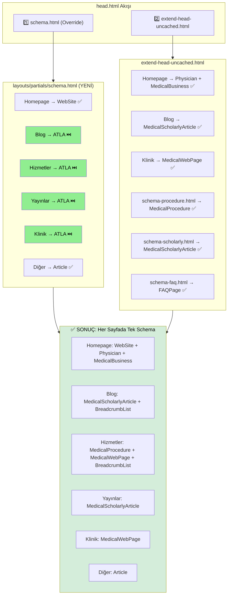

# Düzletilmiş Schema Yapısı

## Akış Diyagramı



## ✅ İmplementasyon Tamamlandı!

### Yapılan Değişiklikler

| Dosya                                        | Değişiklik                                                         |
| -------------------------------------------- | ------------------------------------------------------------------ |
| `layouts/partials/schema.html`               | YENİ - Blowfish override, sayfa tipine göre akıllı schema kontrolü |
| `layouts/partials/schema-faq.html`           | YENİ - FAQ JSON-LD schema partial                                  |
| `layouts/partials/schema-procedure.html`     | Düzeltme: path kontrolü `hizmetler/` → `hizmetler`                 |
| `layouts/partials/extend-head-uncached.html` | FAQ partial eklendi                                                |

### Sonuç

| Sayfa Tipi | Önceki Durum                                | Şimdiki Durum                     |
| ---------- | ------------------------------------------- | --------------------------------- |
| Blog       | ⚠️ Article + MedicalScholarlyArticle (çift) | ✅ Sadece MedicalScholarlyArticle |
| Hizmetler  | ⚠️ Article + MedicalProcedure (çift)        | ✅ Sadece MedicalProcedure        |
| Yayınlar   | ⚠️ Article + MedicalScholarlyArticle (çift) | ✅ Sadece MedicalScholarlyArticle |
| Klinik     | ⚠️ Article + MedicalWebPage (çift)          | ✅ Sadece MedicalWebPage          |

### FAQ Rich Snippets Kullanımı

```yaml
---
title: "Sayfa Başlığı"
faq:
    - question: "Soru 1?"
      answer: "Cevap 1."
    - question: "Soru 2?"
      answer: "Cevap 2."
---
```

Bu şekilde hem mevcut microdata (shortcode ile) hem de JSON-LD (front matter ile) destekleniyor.

> **Not:** Hiçbir Medical schema kaybolmadı, aksine çakışmalar giderildi!
