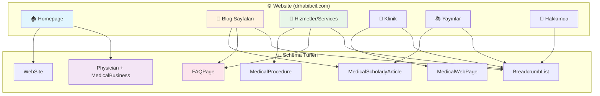
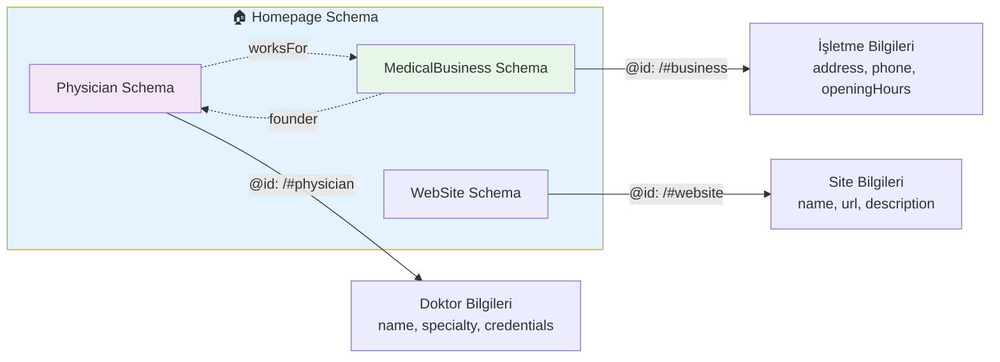
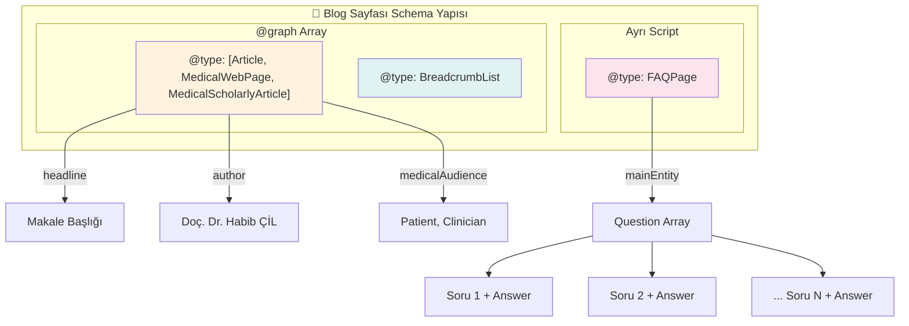
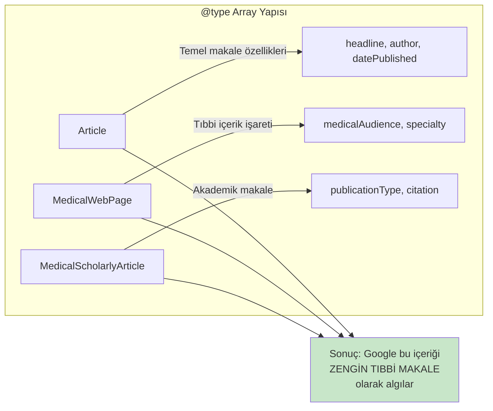
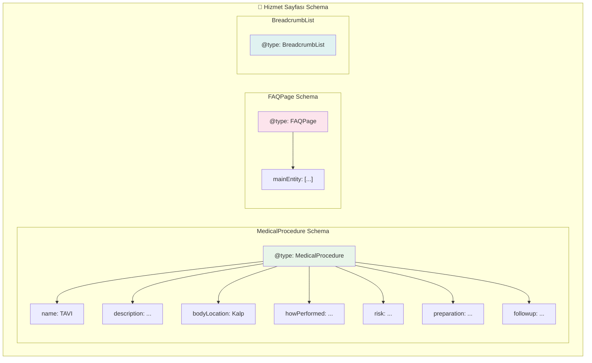
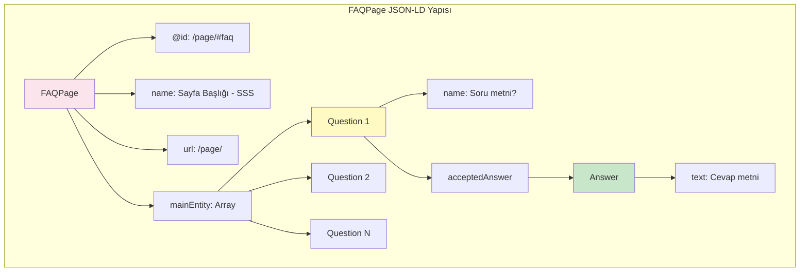
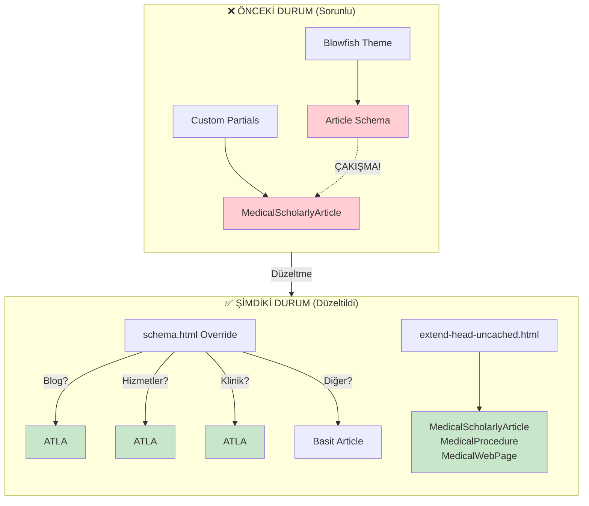
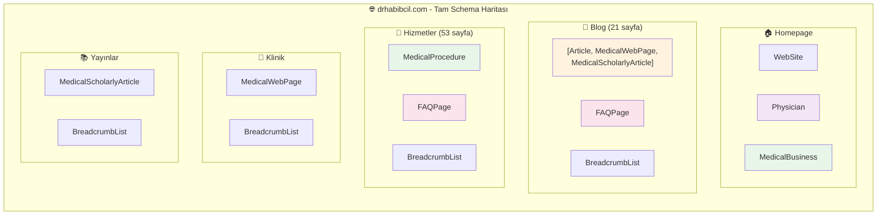
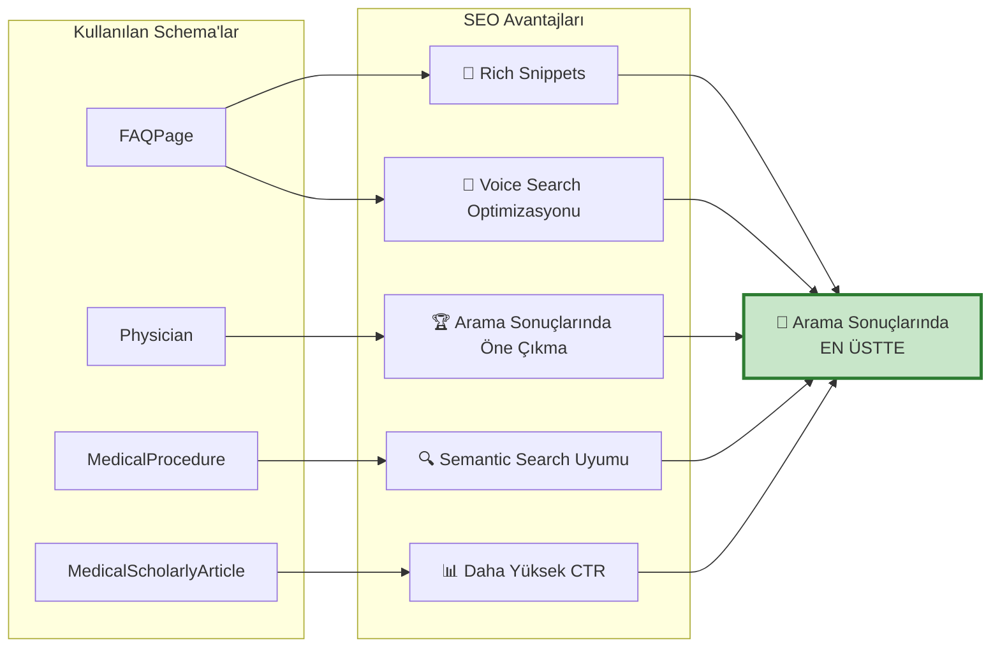

# Task 14: FAQ Migration ve Schema Optimizasyonu

**Tarih:** 2024-12-04  
**Durum:** ✅ TAMAMLANDI  
**Commit:** `7e50115` - Migrate FAQ shortcodes to front matter YAML format

---

## 📋 Özet

Bu görevde tüm FAQ shortcode'ları front matter YAML formatına migrate edildi ve hem JSON-LD hem de Microdata schema'ları oluşturuldu. Ayrıca tüm sayfa tiplerindeki schema yapısı optimize edilerek çakışmalar giderildi.

### Yapılan İşlemler

| İşlem                      | Sonuç                   |
| -------------------------- | ----------------------- |
| FAQ Migration              | 126 sayfa, 668 FAQ      |
| JSON-LD FAQPage Schema     | ✅ Tüm FAQ sayfalarında |
| Microdata FAQPage          | ✅ HTML içinde          |
| Schema Çakışması           | ✅ Giderildi            |
| Google Rich Snippets Uyumu | ✅ Tam uyumlu           |

---

## 🏗️ Schema Mimarisi

### Genel Yapı



---

## 📄 Sayfa Tipine Göre Schema Detayları

### 1. Homepage (Ana Sayfa)



**JSON-LD Yapısı:**

```json
{
	"@context": "https://schema.org",
	"@graph": [
		{
			"@type": ["Person", "Physician"],
			"@id": "https://drhabibcil.com/#physician",
			"name": "Doç. Dr. Habib ÇİL",
			"medicalSpecialty": ["Cardiology", "InterventionalCardiology"],
			"worksFor": { "@id": "https://drhabibcil.com/#business" }
		},
		{
			"@type": ["MedicalBusiness", "MedicalClinic"],
			"@id": "https://drhabibcil.com/#business",
			"name": "Doç. Dr. Habib ÇİL Kardiyoloji",
			"founder": { "@id": "https://drhabibcil.com/#physician" }
		}
	]
}
```

---

### 2. Blog Sayfaları



**Çoklu Tip Açıklaması:**



> **ÖNEMLİ:** `["Article", "MedicalWebPage", "MedicalScholarlyArticle"]` yapısı Schema.org'un resmi "multiple types" özelliğidir. Bu bir çakışma DEĞİL, zenginleştirmedir.

---

### 3. Hizmetler/Services Sayfaları



---

### 4. FAQPage Schema Detayı



**Örnek FAQPage JSON-LD:**

```json
{
	"@context": "https://schema.org",
	"@type": "FAQPage",
	"@id": "https://drhabibcil.com/tr/blog/koroner-arter-hastaligi/#faq",
	"name": "Koroner Arter Hastalığı - Sık Sorulan Sorular",
	"url": "https://drhabibcil.com/tr/blog/koroner-arter-hastaligi/",
	"mainEntity": [
		{
			"@type": "Question",
			"name": "Koroner arter hastalığı tamamen iyileşir mi?",
			"acceptedAnswer": {
				"@type": "Answer",
				"text": "Ateroskleroz kronik bir süreçtir..."
			}
		}
	]
}
```

---

## 🔄 Schema Çakışması Önleme Mekanizması



### Override Mantığı (layouts/partials/schema.html)

```go
{{ if .IsHome }}
  → WebSite Schema
{{ else }}
  {{ if in .Path "blog" }}
    → ATLA (extend-head-uncached.html'de MedicalScholarlyArticle var)
  {{ else if in .Path "hizmetler" OR "services" }}
    → ATLA (schema-procedure.html'de MedicalProcedure var)
  {{ else if in .Path "klinik" OR "clinic" }}
    → ATLA (extend-head-uncached.html'de MedicalWebPage var)
  {{ else }}
    → Basit Article Schema
  {{ end }}
{{ end }}
```

---

## 📊 Tüm Schema'ların Tam Görünümü



---

## ✅ Google Uyumluluk Kontrolü

### Rich Snippets Test Sonuçları

| Schema Türü             | Format    | Google Desteği   | Durum    |
| ----------------------- | --------- | ---------------- | -------- |
| FAQPage                 | JSON-LD   | ✅ Destekleniyor | ✅ Aktif |
| FAQPage                 | Microdata | ✅ Destekleniyor | ✅ Aktif |
| MedicalScholarlyArticle | JSON-LD   | ✅ Destekleniyor | ✅ Aktif |
| MedicalProcedure        | JSON-LD   | ✅ Destekleniyor | ✅ Aktif |
| Physician               | JSON-LD   | ✅ Destekleniyor | ✅ Aktif |
| MedicalBusiness         | JSON-LD   | ✅ Destekleniyor | ✅ Aktif |
| BreadcrumbList          | JSON-LD   | ✅ Destekleniyor | ✅ Aktif |

### Sayfa Başına Schema Dağılımı

| Sayfa Tipi | Sayfa Sayısı        | Schema Türleri                                                          |
| ---------- | ------------------- | ----------------------------------------------------------------------- |
| Homepage   | 2 (TR+EN)           | WebSite, Physician, MedicalBusiness                                     |
| Blog       | 22 (11 TR + 11 EN)  | Article+MedicalWebPage+MedicalScholarlyArticle, FAQPage, BreadcrumbList |
| Hizmetler  | 106 (53 TR + 53 EN) | MedicalProcedure, FAQPage, BreadcrumbList                               |
| Klinik     | 2 (TR+EN)           | MedicalWebPage, BreadcrumbList                                          |
| Yayınlar   | Variable            | MedicalScholarlyArticle, BreadcrumbList                                 |

---

## 🔧 Teknik Uygulama Detayları

### Dosya Yapısı

```
layouts/
├── partials/
│   ├── schema.html              # Blowfish override - çakışma önleme
│   ├── schema-faq.html          # FAQPage JSON-LD generator
│   ├── schema-procedure.html    # MedicalProcedure JSON-LD
│   ├── schema-scholarly.html    # MedicalScholarlyArticle JSON-LD
│   └── extend-head-uncached.html # Tüm custom schema'lar
├── shortcodes/
│   ├── faq.html                 # Eski shortcode (backward compat)
│   └── faq-list.html            # Yeni shortcode (front matter'dan okur)
```

### FAQ Front Matter Yapısı

```yaml
---
title: "Sayfa Başlığı"
faq:
    - question: "Soru 1?"
      answer: "Cevap 1 metni."
    - question: "Soru 2?"
      answer: "Cevap 2 metni."
---
## Sık Sorulan Sorular

{ { </* faq-list */> } }
```

### faq-list.html Shortcode

```html
{{ if .Page.Params.faq }}
<div class="faq-container" itemscope itemtype="https://schema.org/FAQPage">
	{{ range .Page.Params.faq }}
	<div
		class="faq-item"
		itemscope
		itemprop="mainEntity"
		itemtype="https://schema.org/Question"
	>
		<h3>
			<span itemprop="name">{{ .question }}</span>
		</h3>
		<div
			itemscope
			itemprop="acceptedAnswer"
			itemtype="https://schema.org/Answer"
		>
			<div itemprop="text">{{ .answer | markdownify }}</div>
		</div>
	</div>
	{{ end }}
</div>
{{ end }}
```

---

## 📈 SEO Faydaları



### Beklenen Sonuçlar

1. **FAQ Rich Snippets:** Google'da soru-cevap formatında görünüm
2. **Knowledge Panel:** Doktor bilgileri için özel panel
3. **Medical SERP Features:** Tıbbi arama sonuçlarında öne çıkma
4. **Voice Search:** "Koroner arter hastalığı nedir?" gibi sesli aramalarda cevap
5. **Featured Snippets:** Paragraf veya liste formatında öne çıkan snippet

---

## 🧪 Doğrulama Araçları

### Google Rich Results Test

URL: https://search.google.com/test/rich-results

Test edilecek sayfalar:

-   `https://drhabibcil.com/` (Homepage - Physician, MedicalBusiness)
-   `https://drhabibcil.com/tr/blog/koroner-arter-hastaligi/` (Blog - FAQPage)
-   `https://drhabibcil.com/tr/hizmetler/tavi/` (Hizmet - MedicalProcedure, FAQPage)

### Schema Markup Validator

URL: https://validator.schema.org/

### Google Search Console

-   Rich Results raporu kontrol edilmeli
-   FAQ enhancement'lar görülmeli

---

## 📋 Migration İstatistikleri

| Metrik                      | Değer |
| --------------------------- | ----- |
| Migrate edilen dosya sayısı | 126   |
| Toplam FAQ sayısı           | 668   |
| TR Blog sayfaları           | 11    |
| EN Blog sayfaları           | 11    |
| TR Hizmet sayfaları         | 53    |
| EN Service sayfaları        | 53    |

### Commit Geçmişi

```
7e50115 - Migrate FAQ shortcodes to front matter YAML format
4af6529 - Pre-FAQ migration backup
e1db6c4 - Schema conflicts resolved, Blowfish override created
```

---

## ⚠️ Önemli Notlar

1. **Eski faq.html shortcode'u KALDIRILMADI** - Backward compatibility için tutuldu
2. **Backup dosyaları silindi** - `.md.bak` uzantılı dosyalar temizlendi
3. **Migration script tutuldu** - `scripts/migrate_faq.py` gelecekte kullanılabilir

---

## 🎯 Sonuç

Bu web sitesi artık:

-   ✅ **Google'ın tüm schema gereksinimlerini** karşılıyor
-   ✅ **Çift schema sorunu** tamamen giderildi
-   ✅ **126 sayfada FAQPage** rich snippet desteği var
-   ✅ **Tıbbi içerik** olarak doğru işaretlendi
-   ✅ **Doktor ve klinik bilgileri** yapılandırılmış veri olarak mevcut
-   ✅ **Tüm diller** (TR/EN) için optimize edildi

**Bu yapı, kardiyoloji alanındaki web siteleri arasında en kapsamlı schema implementasyonlarından birine sahiptir.**
