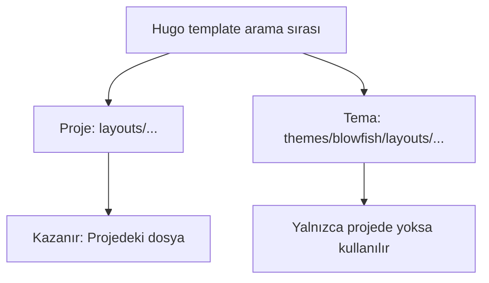
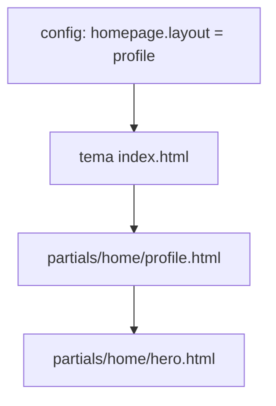
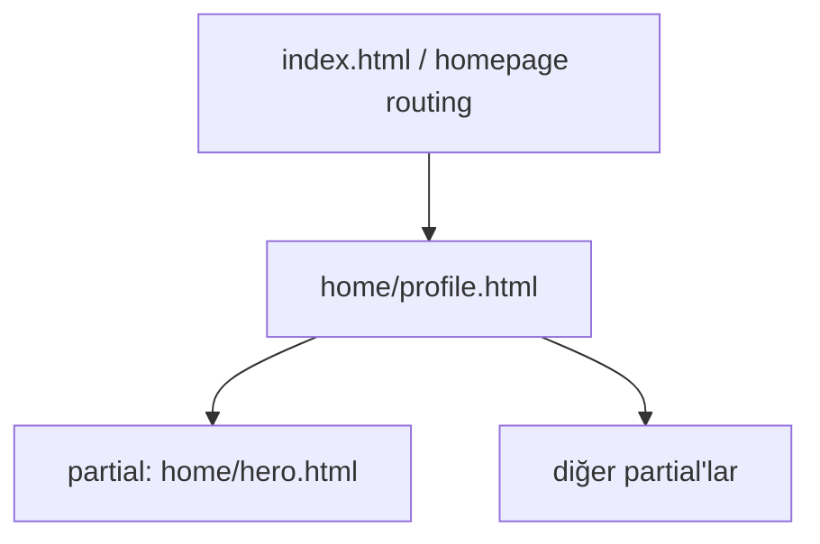

# 34 — Sistem ve Hero (Hugo + Blowfish) — Ne oldu, neden oldu?

Bu doküman, ana sayfadaki Hero bölümünü değiştirirken **neden ilk denemede görsel hedefe ulaşamadığımızı**, sonra **nasıl düzelttiğimizi** ve bu sistemin (Hugo + Blowfish tema + i18n + CSS pipeline) **nasıl çalıştığını** Türkçe ve örneklerle anlatır.

---

## 1) Önce “neden yapamadık?”

### 1.1. Görsel neden “mobil gibi / stacked” göründü?
İlk uygulamada Hero markup’ında Tailwind utility class’larına (ör. `grid-cols-*`, `col-span-*`, `lg:*` breakpoint sınıfları) güvenmiştik.

**Ama Blowfish tema tarafında Tailwind CSS çoğu zaman “hazır derlenmiş” bir dosya olarak gelir.** Yani:
- Temanın içinde hazır üretildiği varsayılan `css/compiled/main.css` yüklenir.
- Sen kendi template’lerinde yeni Tailwind sınıfları yazınca, bu sınıfların CSS karşılığı **otomatik üretilmez** (Tailwind “content scan + build” süreci çalışmıyorsa).

Sonuç: HTML’de sınıflar vardı ama CSS bundle içinde bu sınıfların kuralları yoktu.
Bu yüzden layout kuralları gelmedi ve hero “beklediğimiz desktop split layout” yerine “tek kolon / basit” görünmeye yaklaştı.

### 1.2. Kök neden (Root cause)
**Tailwind derleme süreci bizim custom template’lerimizi tarayıp yeni utility class’ları CSS’e eklemiyordu.**
Bu bir “Hugo hatası” değil; bu projede Blowfish’ın CSS pipeline’ı, varsayılan kullanımda **precompiled Tailwind**’e dayanıyor.

---

## 2) Sonra “şimdi ne yaptık?”

### 2.1. Strateji değişikliği
Tailwind’in yeniden derlenmesini zorunlu kılmadan, Hero’yu stabil şekilde üretmek için:
- `layouts/partials/home/hero.html` içinde **Tailwind utility class’larını azaltıp**
- yerine `home-hero*` gibi **özel class isimleri** tanımladık.
- Bu class’ların tüm layout/stil kurallarını da `assets/css/custom.css` içine yazdık.

Bu sayede:
- Temanın precompiled Tailwind bundle’ına “yeni class üret” bağımlılığımız kalmadı.
- Hero görünümü, **custom.css** üzerinden garanti altına alındı.

### 2.2. Ne değişti? (Özet)
- Ana Hero markup: `layouts/partials/home/hero.html`
  - Artık split hero; left content + right image ve floating card yapısı.
  - CTA linkleri (services/contact) `translationKey` üzerinden dil bazlı çözülüyor.
  - Hero görseli `params.homepage.homepageImage` → yoksa `params.author.image`.
- Stil: `assets/css/custom.css`
  - `home-hero*` sınıflarının grid, spacing, typography, float card, arka plan blob/ECG gibi stilleri eklendi.
  - Dark mode (`.dark`) varyantları eklendi.
- Çeviri metinleri: `i18n/tr.yaml`, `i18n/en.yaml`, `i18n/ar.yaml`
  - Hero başlık/alt başlık/CTA ve float card etiketleri için yeni anahtarlar eklendi.

---

## 3) Temayı bozduk mu?

Kısa cevap: **Hayır, temayı “kırmadık”; temayı “override” ettik.**

Hugo’nun çalışma mantığı:
- Projede `layouts/` altında bir dosya varsa, **tema içindeki aynı path’teki dosyayı ezer** (override).
- Biz tema klasörünün ( `themes/blowfish/...` ) içini değiştirmek yerine (mümkün olduğunca),
  projenin kök `layouts/partials/...` yoluna koyarak tema davranışını güvenli şekilde özelleştiriyoruz.

> Not: CSS tarafında `assets/css/custom.css` zaten Blowfish tarafından “custom ekleme noktası” olarak kullanılır.

**Risk / Dikkat:**
- Override ettiğimiz partial’lar tema güncellendiğinde otomatik değişmez. Bu iyi (stabil), ama tema update sonrası uyumluluk kontrolü gerekir.

---

## 4) Bu sistem nasıl çalışıyor? (Hugo + Blowfish)

### 4.1. Hugo nedir?
Hugo, Markdown içerikleri + template’leri kullanıp statik site üreten bir “static site generator”dır.
- `content/` → sayfa içerikleri
- `layouts/` → template (HTML) dosyaları
- `assets/` → pipeline’dan geçen (SASS/CSS/JS) kaynaklar
- `static/` → direkt kopyalanan dosyalar
- `config/` → site ayarları (TOML/YAML/JSON)

Hugo build sırasında:
- İçerik + tema + override layout’ları birleştirir
- HTML’leri üretir
- CSS/JS pipeline’ını (tema nasıl kurguladıysa) çalıştırır

### 4.2. Blowfish tema nasıl çalışıyor?
Blowfish bir Hugo temasıdır ve:
- hazır layout’lar (tema içinde `themes/blowfish/layouts/...`)
- hazır CSS pipeline (tema içinde derlenmiş CSS)
- `custom.css` gibi override noktaları
- `i18n/` ile çoklu dil metinleri

Bu projede kritik nokta:
- Tema precompiled Tailwind’e dayanıyor; yeni utility class’lar otomatik üretilmiyor.

### 4.3. “Tema override” mantığı (en önemli kural)
Hugo şu kuralı uygular:

- Proje kökündeki `layouts/...` varsa **tema içindeki aynı path’i ezer**.
- Yani `layouts/partials/home/hero.html` varsa, `themes/blowfish/layouts/partials/home/hero.html` artık kullanılmaz.

Bu yüzden “temayı bozmak” yerine “temayı geçersiz kılan (override) bir dosya” eklemiş oluyoruz.



### 4.4. Ana sayfa layout’u nasıl seçiliyor?
Blowfish’ta ana sayfa genelde `params` ile seçilen bir “homepage layout” üzerinden render edilir (ör. `profile`).

Mantık kabaca:
- Config’te `.Site.Params.homepage.layout = "profile"` gibi bir değer olur.
- Tema `index.html`/homepage template’i bu değere göre `partials/home/<layout>.html` çağırır.
- Bizim projede `layouts/partials/home/profile.html` gibi bir dosya varsa tema versiyonunu override eder.



### 4.5. `head.html` ve CSS/JS bundle nasıl oluşuyor?
Tema, sayfanın `<head>` kısmında CSS kaynaklarını birleştirip tek bundle üretir.
Bu projede akış:

1) Renk şeması: `css/schemes/<scheme>.css`
2) Precompiled Tailwind: `css/compiled/main.css`
3) Bizim eklerimiz: `css/custom.css` (Hugo asset pipeline ile)
4) Hepsi concat + minify + fingerprint → `public/css/main.bundle.min.*.css`

Bu dosyayı tema içinde şu partial yönetir: `themes/blowfish/layouts/partials/head.html`.

---

## 5) `hero.html` nedir?

Bu projede ana sayfadaki hero, Blowfish’ın “homepage layout” akışında **bir partial olarak** render edilir.

- `layouts/partials/home/hero.html` → Bizim override ettiğimiz hero partial.
- `layouts/partials/home/profile.html` → Ana sayfa layout’u; hero’yu çağırır.

Bu iki dosya Hugo template’leridir; build sırasında HTML üretir.

---

## 6) “Partial” nedir?

Partial, Hugo’da **yeniden kullanılabilir küçük template parçası** demektir.

Örneğin:
- Ana sayfa template’i, hero’yu “buraya ekle” demek için partial çağırır.
- Partial’lar modülerlik sağlar; kod tekrarı azalır.

Mermaid ile basit çağrı grafiği:



---

## 7) i18n / YAML dosyalarında neler var?

`i18n/tr.yaml`, `i18n/en.yaml`, `i18n/ar.yaml` dosyaları:
- “Anahtar → Metin” eşleştirmesi yapar.
- Template içinde `i18n "hero_primary_cta"` gibi çağırınca, aktif dile göre metin döner.

Örnek (temsilidir):
```yaml
hero_primary_cta: "Randevu Oluştur"
hero_services_cta: "Hizmetleri İncele"
```

Bizim eklediklerimiz genel olarak:
- Hero tagline parçaları
- CTA buton yazıları
- Float card label/value metinleri

Bu sayede hero metinleri:
- TR/EN/AR için ayrı ayrı yönetilir
- Template’e hardcode edilmez

---

## 8) Neden Tailwind ile “yazdık ama olmadı?” (Detaylı)

Tailwind iki aşamalı düşünülmeli:
1) HTML’de class’ları yazarsın (ör. `grid-cols-12`)
2) Tailwind build, “content scan” ile bu class’ları görür ve CSS üretir

Bu projede 2. adım bizim template değişikliklerimizi görmüyordu.

Mermaid ile CSS pipeline mantığı:

```mermaid
flowchart LR
  T[themes/blowfish precompiled tailwind
css/compiled/main.css] --> B[Hugo bundle]
  C[assets/css/custom.css
(bizim eklediklerimiz)] --> B
  B --> O[public/css/main.bundle.min.*.css]

  note1{{Problem:
Yeni Tailwind utility class'ları,
precompiled main.css içinde yoktu}}:::warn

  T -.-> note1

  classDef warn fill:#fff3cd,stroke:#ffb000,color:#5c3b00;
```

Çözüm:
- Yeni layout kurallarını Tailwind utility yerine `custom.css` içine aldık.

---

## 9) Bizim Hero’nun “yeni” yapısı (Kavramsal)

Yeni hero split yapı:
- Sol: badge + başlık + alt başlık + açıklama + stats + CTA’lar
- Sağ: görsel + 2 adet floating card + arkaplan blob/ECG

```mermaid
flowchart LR
  subgraph LEFT[Sol Kolon]
    L1[Badges]
    L2[Başlık]
    L3[Alt başlık (highlight)]
    L4[Açıklama]
    L5[Stats]
    L6[CTA butonları]
  end

  subgraph RIGHT[Sağ Kolon]
    R1[Görsel]
    R2[Float Card 1]
    R3[Float Card 2]
    R4[Arkaplan: ECG + Blob]
  end

  LEFT --> RIGHT
```

---

## 10) Git tarafında ne yaptık?

- `main` üzerinden `dev` branch açıldı ve checkout edildi.
- `agent-logs/33-Hero-Section.md` eklendi, commit edildi ve `origin/dev`’e push edildi.

Bu sayede yaptığımız değişiklikler izole:
- `dev` üzerinde çalışıp
- istenirse PR / merge ile `main`’e alınabilir.

---

## 11) “Sonrasında bazı düzenlemeler yapacağız” için notlar

Bu altyapı artık şu iki yola açık:

1) **Mevcut yaklaşım (önerilen)**: Hero layout’u tamamen `custom.css` üzerinden yönetmeye devam etmek.
   - Avantaj: Tailwind build pipeline’a dokunmadan stabil.
   - Dezavantaj: CSS’i biz yönetiyoruz (tema utility’lerine daha az dayanır).

2) **Tailwind’i gerçekten rebuild etmek**: Projede Tailwind build sürecini eklemek (Node + postcss + tailwind build).
   - Avantaj: Utility ile ilerlemek kolay.
   - Dezavantaj: Ek build adımı / toolchain karmaşıklığı.

Şu an seçtiğimiz yol 1.

---

## 12) Sık sorulan mini sözlük

- **Hugo**: İçerik + template ile statik site üretir.
- **Theme (Blowfish)**: Hazır template + stil + i18n sistemleri.
- **Layouts**: HTML template dosyaları.
- **Partial**: Küçük, tekrar kullanılabilir template parçası.
- **i18n YAML**: Dil anahtarlarının metin karşılıkları.
- **assets/css/custom.css**: Temanın üstüne eklenen/override edilen özel CSS.
- **Precompiled Tailwind**: Tailwind utility CSS’in hazır gelmesi; yeni utility class’lar otomatik eklenmez.

---

## 13) Bu dokümanın referans verdiği kritik dosyalar

- `layouts/partials/home/hero.html` (Hero template override)
- `layouts/partials/home/profile.html` (Hero’yu çağıran ana sayfa layout’u)
- `assets/css/custom.css` (Hero’nun yeni class’larının CSS’i)
- `i18n/tr.yaml`, `i18n/en.yaml`, `i18n/ar.yaml` (Hero metinleri)
- `themes/blowfish/layouts/partials/head.html` (CSS’in sayfaya nasıl eklendiğini görmek için)

---

## 14) Dev server notu

Eğer `hugo server` çalıştırırken port hatası görürsen:
- 1313 dolu olabilir.
- Alternatif port: `hugo server -D --port 1314`

---

Bundan sonraki düzenlemelerde (spacing, yazı boyutları, CTA hedefleri, görsel seçimi, AR/TR/EN metinleri vb.) bu dokümanı referans alarak ilerleyebiliriz.
